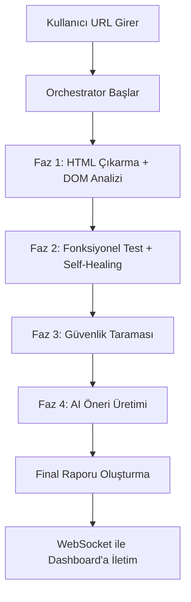

# Yazılım Gereksinim Spesifikasyonu (SRS)
## AI-Driven Self-Healing Web Quality Assurance Platform

**Doküman Versiyonu:** 1.0  
**Tarih:** 28 Nisan 2026  
**Proje Adı:** SelfHealing — Yapay Zeka Destekli Otonom Web Kalite Güvence Platformu

---

## 1. Giriş

### 1.1 Amaç
Bu doküman, yapay zeka destekli otonom web kalite güvence platformunun yazılım gereksinimlerini IEEE 830 standardına uygun olarak tanımlamaktadır. Sistem; DOM analizi, fonksiyonel test yürütme, güvenlik taraması ve AI tabanlı self-healing (kendini iyileştirme) mekanizmalarını tek bir orkestrasyon katmanı altında birleştiren, kanıt tabanlı (evidence-based) bir QA motorudur.

### 1.2 Kapsam
Platform iki ana bileşenden oluşmaktadır:

| Bileşen | Teknoloji | Sorumluluk |
|---------|-----------|------------|
| **Backend** | Node.js / Express.js | REST API, Puppeteer tabanlı test yürütme, AI self-healing, güvenlik taraması, WebSocket gerçek zamanlı iletişim |
| **Frontend** | React 19 + Vite | Dashboard UI, gerçek zamanlı log akışı, kanıt görselleştirme, otonom mod yönetimi |

### 1.3 Tanımlar ve Kısaltmalar

| Kısaltma | Açıklama |
|----------|----------|
| SRS | Software Requirements Specification |
| DOM | Document Object Model |
| QA | Quality Assurance |
| E2E | End-to-End |
| LLM | Large Language Model |
| XSS | Cross-Site Scripting |
| SQLi | SQL Injection |
| SPA | Single Page Application |
| CSS | Cascading Style Sheets |

### 1.4 Referanslar
- IEEE 830-1998 Yazılım Gereksinim Spesifikasyonu Standardı
- Google Gemini API Dokümantasyonu
- Puppeteer API Referansı (v22)
- OWASP Top 10 Web Güvenlik Riskleri

---

## 2. Genel Tanımlama

### 2.1 Ürün Perspektifi
Platform, geleneksel statik test araçlarının ötesine geçerek yapay zeka destekli dinamik bir kalite güvence mekanizması sunmaktadır. Sistemin ayırt edici özellikleri:

1. **Otonom Orkestrasyon:** Tek bir URL girişiyle DOM analizi → fonksiyonel test → güvenlik taraması → AI öneri üretimi zincirini otomatik yürütür.
2. **Self-Healing (Kendini İyileştirme):** Kırılmış CSS seçicileri Google Gemini LLM kullanarak otomatik onarır.
3. **Kanıt Tabanlı Test:** Her adım için before/after ekran görüntüsü, DOM snapshot, ağ logları ve güven skoru üretir.
4. **Gerçek Zamanlı İzleme:** WebSocket üzerinden canlı log akışı ve olay bildirimi.

### 2.2 Ürün Fonksiyonları (Özet)



### 2.3 Kullanıcı Sınıfları

| Kullanıcı | Açıklama |
|-----------|----------|
| **QA Mühendisi** | Otonom test çalıştırır, sonuçları analiz eder |
| **Web Geliştirici** | DOM ve güvenlik bulgularını inceler, önerileri uygular |
| **Proje Yöneticisi** | Genel kalite skorlarını ve risk raporlarını takip eder |

### 2.4 Çalışma Ortamı
- **Sunucu:** Node.js ≥ 18, MongoDB (opsiyonel, in-memory fallback mevcut)
- **İstemci:** Modern web tarayıcı (Chrome, Firefox, Edge)
- **Dış Bağımlılıklar:** Google Gemini API, Puppeteer (Chromium)

### 2.5 Kısıtlamalar
- Gemini API ücretsiz katman limiti: ~15 istek/dakika
- Puppeteer headless tarayıcı bellek tüketimi
- Güvenlik tarayıcısı yalnızca XSS ve SQLi vektörlerini kapsar
- Maksimum orkestrasyon süresi: 8 dakika

---

## 3. Sistem Mimarisi

### 3.1 Katmanlı Mimari

```
┌─────────────────────────────────────────────────────┐
│                   FRONTEND (React 19 + Vite)         │
│  ┌──────────┐ ┌──────────┐ ┌───────────┐           │
│  │ Dashboard │ │ QA Panel │ │ Evidence  │           │
│  │  Pages    │ │Components│ │ Viewer    │           │
│  └──────────┘ └──────────┘ └───────────┘           │
│         │            │            │                  │
│         ▼            ▼            ▼                  │
│  ┌─────────────────────────────────────┐            │
│  │    SocketContext + UrlContext        │            │
│  └─────────────────────────────────────┘            │
├─────────────────────────────────────────────────────┤
│              REST API + WebSocket (Socket.IO)        │
├─────────────────────────────────────────────────────┤
│                   BACKEND (Node.js / Express)        │
│  ┌──────────────────────────────────────────────┐   │
│  │              Routes & Controllers             │   │
│  │   analyze.routes │ testing.routes │ health    │   │
│  └──────────────────────────────────────────────┘   │
│  ┌──────────────────────────────────────────────┐   │
│  │              Services Layer                   │   │
│  │ scraper │ domAnalyzer │ aiAnalyzer │ static  │   │
│  └──────────────────────────────────────────────┘   │
│  ┌──────────────────────────────────────────────┐   │
│  │              Engines Layer                    │   │
│  │ testRunner │ selfHealing │ scoring │ security│   │
│  │                orchestrator                   │   │
│  └──────────────────────────────────────────────┘   │
│  ┌──────────────────────────────────────────────┐   │
│  │              Utilities                        │   │
│  │ cache │ queue │ logger │ socketManager        │   │
│  └──────────────────────────────────────────────┘   │
├─────────────────────────────────────────────────────┤
│  External: Gemini API │ Puppeteer/Chromium │ MongoDB │
└─────────────────────────────────────────────────────┘
```

### 3.2 Bileşen Detayları

#### 3.2.1 Backend Modülleri

| Modül | Dosya | Sorumluluk |
|-------|-------|------------|
| Orchestrator | `engines/orchestrator.js` | 4 fazlı otonom test akışını yönetir, skor hesaplar, final rapor üretir |
| Test Runner | `engines/testRunner.js` | Puppeteer ile E2E test adımlarını yürütür, kanıt (evidence) toplar |
| Self-Healing | `engines/selfHealing.js` | Kırılmış CSS seçicilerini Gemini AI ile onarır |
| Scoring | `engines/scoring.js` | Ağırlıklı güvenilirlik skoru hesaplar (DOM, Ağ, Görsel, Stabilite) |
| Security Scanner | `engines/securityScanner.js` | XSS ve SQLi payload enjeksiyonu ile aktif güvenlik taraması |
| DOM Analyzer | `services/domAnalyzer.js` | Cheerio ile erişilebilirlik, SEO ve yapısal kontroller |
| Scraper | `services/scraper.service.js` | Stealth Puppeteer ile HTML çıkarma, üstel geri çekilme (exponential backoff) |
| AI Analyzer | `services/aiAnalyzer.js` | Gemini API ile UX/İçerik/SEO denetimi |
| Static Analyzer | `services/staticAnalyzer.js` | AI devre dışı kaldığında kural tabanlı fallback motor |

#### 3.2.2 Frontend Modülleri

| Modül | Dosya | Sorumluluk |
|-------|-------|------------|
| App | `App.jsx` | Kök bileşen, ErrorBoundary + Context provider'lar |
| Router | `routes/index.jsx` | Lazy-load code splitting ile sayfa yönlendirme |
| SocketContext | `contexts/SocketContext.jsx` | WebSocket bağlantı yönetimi, gerçek zamanlı veri state'i |
| QADashboard | `components/QADashboard.jsx` | Canlı konsol, zaman çizelgesi, self-healing panel |
| API Service | `services/api.js` | Axios tabanlı backend iletişim katmanı |

---

## 4. Fonksiyonel Gereksinimler

### FR-01: Web Sitesi Analizi
- **Açıklama:** Kullanıcı bir URL girerek web sitesi analizi başlatabilmelidir.
- **Girdi:** Geçerli bir HTTP/HTTPS URL
- **Çıktı:** DOM analiz raporu, AI/statik analiz içgörüleri, öncelikli aksiyonlar
- **İş Akışı:**
  1. URL doğrulaması (format kontrolü)
  2. Rate limiter kontrolü (10 istek/dakika/IP)
  3. Cache kontrolü (24 saat TTL)
  4. Puppeteer Stealth ile HTML çıkarma (3 deneme, exponential backoff)
  5. DOM analizi (erişilebilirlik + SEO + yapı)
  6. AI analizi (Gemini) veya statik fallback
  7. Sonuçların birleştirilmesi ve döndürülmesi

### FR-02: Otonom QA Orkestrasyon
- **Açıklama:** Tek tıklamayla 4 fazlı tam QA akışı başlatılabilmelidir.
- **Fazlar:**
  1. HTML çıkarma + DOM analizi
  2. Fonksiyonel testler + self-healing
  3. Güvenlik taraması (XSS/SQLi)
  4. AI öneri üretimi
- **Çıktı:** Genel skor (0-100), kategori bazlı bulgular, öneriler
- **Zaman Aşımı:** Maksimum 8 dakika

### FR-03: Kanıt Tabanlı Test Yürütme
- **Açıklama:** Her test adımı için doğrulanabilir kanıt toplanmalıdır.
- **Desteklenen Aksiyonlar:** `click`, `type/input`, `verify`, `navigate`, `wait`
- **Toplanan Kanıtlar (her adım için):**

| Kanıt Türü | Açıklama |
|------------|----------|
| Screenshot Before/After | Base64 kodlu PNG ekran görüntüleri |
| DOM Snapshot Before/After | İlgili elementlerin HTML durumu |
| DOM Diff | Eklenen/silinen satır sayısı |
| Element Found | Seçicinin DOM'da bulunup bulunmadığı |
| Bounding Box | Elementin ekran koordinatları |
| Network Requests | Adım sırasında yapılan HTTP istekleri |
| Console Logs | Tarayıcı konsol çıktıları |
| Execution Confidence | 0-100 güven skoru |

### FR-04: AI Self-Healing Mekanizması
- **Açıklama:** Kırılmış CSS seçicileri otomatik onarılmalıdır.
- **Algoritma:**
  1. Test adımında seçici bulunamazsa (timeout/selector hatası)
  2. Önce SmartMemory veritabanı kontrol edilir
  3. Hafızada çözüm yoksa DOM snapshot Gemini'ye gönderilir
  4. AI yanıtı %70+ güven skoruna sahipse uygulanır
  5. Başarılı onarım hafızaya kaydedilir
- **Maksimum Deneme:** 3 (retry loop)

### FR-05: Güvenilirlik Skorlama
- **Açıklama:** Test sonuçları çok boyutlu güvenilirlik skoru ile değerlendirilir.
- **Formül:**

```
Reliability = (0.30 × DOM Accuracy)
            + (0.20 × Network Success Rate)
            + (0.20 × Visual Confidence)
            + (0.20 × Execution Stability)
            - (0.10 × Healing Penalty)
```

- **Çıktılar:** Skor (0-100), güven seviyesi (low/medium/high), risk bayrakları

### FR-06: Güvenlik Taraması
- **Açıklama:** Aktif XSS ve SQLi güvenlik testleri yapılmalıdır.
- **Yöntem:**
  1. Input alanları tespit edilir
  2. XSS payload enjekte edilir (`<script>` tag)
  3. SQL injection payload enjekte edilir (`' OR 1=1; --`)
  4. DOM yansıma ve konsol çıktısı kontrol edilir
  5. Bulgular severity ile sınıflandırılır (Critical/High/Medium/Low)

### FR-07: Gerçek Zamanlı İzleme
- **Açıklama:** Tüm test ve analiz süreçleri WebSocket üzerinden canlı izlenebilmelidir.
- **WebSocket Kanalları:**

| Kanal | Veri |
|-------|------|
| `log_stream` | Anlık log mesajları |
| `step_evidence` | Adım bazlı kanıt nesneleri |
| `autonomous_event` | Orkestrasyon olay akışı |
| `autonomous_report_generated` | Final rapor |
| `issue_detected` | Tespit edilen sorunlar |
| `fix_generated` / `fix_success` / `fix_failed` | Self-healing olayları |

### FR-08: DOM Analizi
- **Açıklama:** HTML yapısı üzerinde otomatik kalite kontrolü yapılmalıdır.
- **Kontrol Kategorileri:**
  - **Erişilebilirlik:** alt attribute eksik resimler, metin içermeyen butonlar, label eksik input'lar
  - **SEO:** eksik title, meta description, h1 kontrolü
  - **Yapısal:** duplike ID'ler, boş linkler, eksik lang attribute

### FR-09: Akıllı Önbellek ve Deduplikasyon
- **Açıklama:** Aynı URL için tekrarlı istekler optimize edilmelidir.
- **TTL:** 24 saat
- **Deduplikasyon:** Aynı anda gelen eşzamanlı istekler tek bir işleme birleştirilir

### FR-10: Graceful Degradation
- **Açıklama:** AI servisi başarısız olduğunda sistem kural tabanlı statik motora geçmelidir.
- **Fallback Zinciri:** Gemini AI → Static Analyzer
- **MongoDB bağlantı hatası:** In-memory Map yapısına fallback

---

## 5. Fonksiyonel Olmayan Gereksinimler

### NFR-01: Performans
| Metrik | Hedef |
|--------|-------|
| API yanıt süresi (analiz) | < 30 saniye |
| Otonom orkestrasyon | < 8 dakika |
| WebSocket gecikme | < 500ms |
| Eşzamanlı Gemini istekleri | Maks 2 (Bottleneck ile) |

### NFR-02: Güvenilirlik
- Rate limiting: 10 istek/dakika/IP
- Retry mekanizması: Exponential backoff (2s, 4s, 8s, 16s) + %20 jitter
- Timeout koruması: Tüm ağ isteklerinde zaman aşımı
- Graceful degradation: AI → Statik, MongoDB → In-Memory

### NFR-03: Güvenlik
- CORS politikası yapılandırılabilir
- Input validasyonu (URL format kontrolü)
- API key'ler environment variable'lardan yüklenir
- Puppeteer stealth plugin (bot algılama önleme)

### NFR-04: Ölçeklenebilirlik
- Bottleneck kuyruk sistemi ile API rate limiting
- Cache + deduplikasyon ile gereksiz işlem önleme
- Code splitting (lazy loading) ile frontend optimizasyonu

### NFR-05: Bakım Kolaylığı
- Modüler katmanlı mimari (routes → controllers → services → engines)
- SmartMemory: Öğrenilen onarımları saklayarak tekrar kullanma
- Yapılandırılabilir eşik değerleri

---

## 6. Dış Arayüz Gereksinimleri

### 6.1 REST API Uç Noktaları

| Metod | Endpoint | Açıklama |
|-------|----------|----------|
| POST | `/api/analyze-url` | Web sitesi analizi başlatır |
| GET | `/api/health` | Sistem sağlık kontrolü |
| POST | `/api/test/run` | E2E test yürütür |
| POST | `/api/test/security` | Güvenlik taraması başlatır |
| POST | `/api/test/autonomous` | Otonom orkestrasyon başlatır (202 Accepted) |

### 6.2 WebSocket Protokolü
- **Bağlantı:** `ws://localhost:3000` (Socket.IO)
- **Yön:** Sunucu → İstemci (tek yönlü broadcast)
- **Veri Formatı:** JSON

### 6.3 Dış Servis Entegrasyonları
- **Google Gemini API:** `generativelanguage.googleapis.com/v1/models/gemini-2.5-flash`
- **MongoDB:** `mongodb://localhost:27017/kalitedb` (opsiyonel)

---

## 7. Veri Modeli

### 7.1 HealedSelector (MongoDB/In-Memory)

| Alan | Tip | Açıklama |
|------|-----|----------|
| oldSelector | String | Orijinal kırılmış CSS seçici |
| newSelector | String | AI tarafından bulunan yeni seçici |
| successRate | Number | Başarılı kullanım sayacı |
| action | String | İlgili test aksiyonu |
| lastUsed | Date | Son kullanım tarihi |

### 7.2 Evidence Object (Test Adımı Kanıtı)

| Alan | Tip | Açıklama |
|------|-----|----------|
| stepId | Number | Adım numarası |
| action | String | Test aksiyonu (click/type/verify/navigate/wait) |
| target | String | Hedef seçici veya değer |
| status | String | success / failed / healed |
| evidence.screenshotBefore | String | Base64 PNG (önceki durum) |
| evidence.screenshotAfter | String | Base64 PNG (sonraki durum) |
| evidence.domSnapshotBefore | String | HTML snapshot (önceki) |
| evidence.domSnapshotAfter | String | HTML snapshot (sonraki) |
| evidence.domDiff | Object | {changed, addedLines, removedLines} |
| evidence.networkRequests | Array | [{url, method, statusCode}] |
| evidence.executionConfidence | Number | 0-100 güven skoru |

### 7.3 Autonomous Report (Orkestrasyon Raporu)

| Alan | Tip | Açıklama |
|------|-----|----------|
| runId | String | Benzersiz çalışma ID'si |
| url | String | Hedef URL |
| overallScore | Number | 0-100 genel kalite skoru |
| domSummary | Object | {totalIssues, high, medium, low} |
| testSteps | Array | Adım bazlı test sonuçları |
| healingEvents | Array | Self-healing olayları |
| securityFindings | Array | Güvenlik bulguları |
| aiRecommendations | Array | Öncelikli aksiyon önerileri |

---

## 8. Teknoloji Yığını

### 8.1 Backend Bağımlılıkları

| Paket | Versiyon | Kullanım Amacı |
|-------|----------|----------------|
| express | ^4.19.0 | HTTP sunucu framework |
| puppeteer | ^22.0.0 | Headless tarayıcı otomasyonu |
| puppeteer-extra + stealth | ^3.3.6 | Bot algılama önleme |
| @google/generative-ai | ^0.24.1 | Gemini SDK |
| socket.io | ^4.8.3 | Gerçek zamanlı WebSocket |
| cheerio | ^1.2.0 | Sunucu taraflı DOM parsing |
| mongoose | ^9.3.3 | MongoDB ODM |
| bottleneck | ^2.19.5 | API rate limiting kuyruğu |
| axios + axios-retry | ^1.14.0 | HTTP istemci + retry |
| node-cache | ^5.1.2 | In-memory önbellek |
| express-rate-limit | ^8.3.2 | IP tabanlı rate limiting |
| morgan | ^1.10.1 | HTTP request logging |

### 8.2 Frontend Bağımlılıkları

| Paket | Versiyon | Kullanım Amacı |
|-------|----------|----------------|
| react | ^19.2.4 | UI framework |
| react-router-dom | ^7.14.0 | Client-side routing |
| vite | ^8.0.1 | Build tool + dev server |
| framer-motion | ^11.0.0 | Animasyon kütüphanesi |
| lucide-react | ^0.400.0 | İkon kütüphanesi |
| socket.io-client | ^4.8.3 | WebSocket istemci |
| axios | ^1.14.0 | HTTP istekleri |
| tailwindcss | ^3.4.19 | CSS framework |

---

## 9. Skor Hesaplama Algoritması

### 9.1 Güvenilirlik Skoru (Reliability Score)

```
Reliability = (0.30 × DOM_Accuracy)
            + (0.20 × Network_Success_Rate)
            + (0.20 × Visual_Confidence)
            + (0.20 × Execution_Stability)
            - (0.10 × Healing_Penalty)
```

**Sinyal Açıklamaları:**
- **DOM Accuracy:** Seçicilerin DOM'da bulunma yüzdesi
- **Network Success Rate:** HTTP yanıtlarının başarı yüzdesi (< 400)
- **Visual Confidence:** Ortalama executionConfidence skoru
- **Execution Stability:** Başarılı/iyileşen adım yüzdesi
- **Healing Penalty:** İyileştirme gerektiren adım yüzdesi (yüksek = kötü)

### 9.2 Genel Kalite Skoru (Overall Score)

```
Penalty = (high_issues × 10) + (medium_issues × 5)
        + (security_issues × 15) + (failed_tests × 5)
Overall = max(0, 100 - Penalty)
```

---

## 10. Doğrulama ve Test Planı

### 10.1 Birim Testleri
- DOM Analyzer: Farklı HTML yapılarında sorun tespiti doğruluğu
- Scoring Engine: Bilinen kanıt setleriyle skor hesaplama tutarlılığı
- Cache: TTL süresi dolumu ve deduplikasyon davranışı

### 10.2 Entegrasyon Testleri
- Orchestrator: 4 fazın sıralı yürütülmesi
- Self-Healing: Kasıtlı olarak kırılmış seçicilerin onarılması
- WebSocket: Tüm olay kanallarının istemciye iletilmesi

### 10.3 Sistem Testleri
- Farklı web sitelerinde otonom çalışma performansı
- Graceful degradation senaryoları (AI kapalı, MongoDB kapalı)
- Eşzamanlı istek yük testi

---

## 11. Sonuç

Bu SRS dokümanı, AI-Driven Self-Healing Web Quality Assurance Platform'un tüm fonksiyonel ve fonksiyonel olmayan gereksinimlerini, sistem mimarisini, veri modellerini, algoritmaları ve teknoloji yığınını kapsamlı olarak tanımlamaktadır. Sistemin özgün katkısı; yapay zeka destekli seçici onarımı (self-healing), kanıt tabanlı test yürütme ve çok katmanlı otonom orkestrasyon mekanizmalarını entegre bir platform altında birleştirmesidir. Bu yaklaşım, geleneksel test bakım maliyetlerini düşürürken test güvenilirliğini artırmayı hedeflemektedir.
